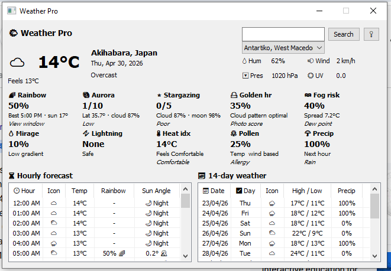

# Weather Pro

A Windows desktop weather application built with Go and the wui GUI framework. Get detailed weather forecasts, unique meteorological predictions like rainbow chances, aurora visibility, and stargazing ratings.

## Features

- **Current Weather**: Temperature, feels-like, humidity, wind, pressure, and UV index
- **7-Day Forecast**: Daily highs/lows with precipitation probabilities
- **Hourly Forecast**: 24-hour breakdown with temperature, weather icons, and sun angles
- **Smart Predictions**:
  - 🌈 Rainbow probability scoring
  - 🌌 Aurora visibility rating
  - ⭐ Stargazing conditions
  - 🌅 Golden hour photography score
  - 🌫️ Fog risk assessment
  - 💧 Mirage probability
  - ⚡ Lightning risk alert
  - 🌡️ Heat index with comfort rating
  - 🌻 Pollen index
- **Location Support**:
  - Search any city worldwide
  - Auto-detect your current location via IP

## Screenshots



## Installation

### Prerequisites
- Windows operating system
- Internet connection for weather data

### Download
Download the latest `weather.exe` from the [Releases](https://github.com/2dprototype/WeatherPro/releases) page.

### Build from Source

```bash
# Clone the repository
git clone https://github.com/2dprototype/WeatherPro.git
cd WeatherPro

# Install dependencies
go mod tidy

# Build
go build -ldflags="-H windowsgui" -o weather.exe main.go
```

## Usage

1. Launch `weather.exe`
2. The app will automatically detect your location
3. Search for any city using the search box
4. Click on any day in the daily forecast to see detailed hourly data
5. Click the 📍 button to re-detect your location

### Weather Cards

Each card provides a score (0-100%, 0-10, or 0-5 rating) with detailed breakdowns:

- **Rainbow**: Sun angle + precipitation + cloud cover analysis
- **Aurora**: Latitude + cloud cover + moon phase calculation
- **Stargazing**: Cloud cover + humidity + moon illumination
- **Golden Hour**: Cloud patterns + humidity + UV index
- **Fog Risk**: Temperature-dew point spread + humidity + wind speed
- **Mirage**: Temperature-based probability for hot/cold conditions
- **Lightning**: Weather code + humidity + wind speed
- **Heat Index**: Calculated apparent temperature with comfort rating
- **Pollen**: Temperature + humidity + wind speed based index

## Data Sources

- **Weather Data**: [Open-Meteo API](https://open-meteo.com/)
- **Geocoding**: [Open-Meteo Geocoding API](https://open-meteo.com/en/docs/geocoding-api)
- **Location Detection**: [ip-api.com](http://ip-api.com/)

## Logging

Weather data is automatically logged to:
```
%EXEDIR%/WeatherPro/YYYY-MM-DD.log
```

## License

MIT License - see [LICENSE](LICENSE) file for details.

## Acknowledgments

- Weather forecasts powered by Open-Meteo's free API